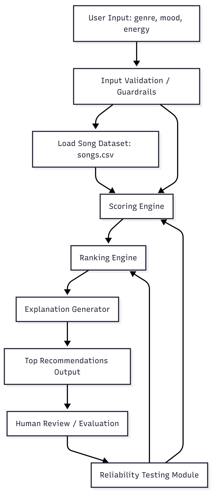
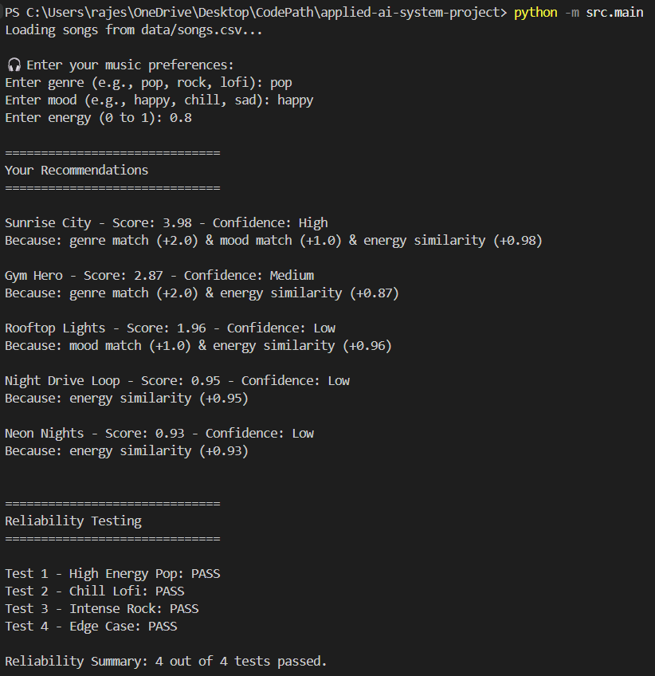
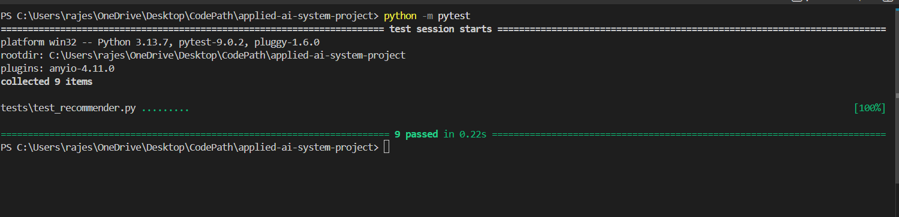
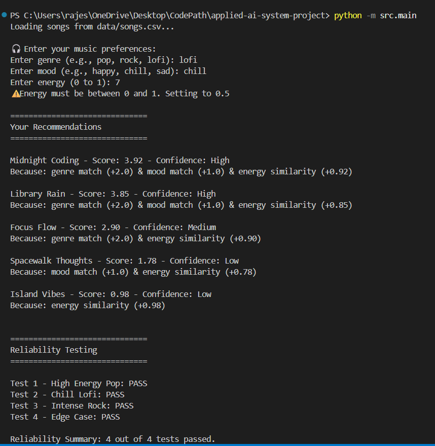

# 🎧 Applied AI Music Recommender System

## Project Summary

This project extends my earlier **Music Recommender Simulation** into a more complete applied AI system.

The system takes user preferences such as genre, mood, and energy level, then recommends songs from a dataset using weighted scoring logic. It also explains each recommendation, applies guardrails for invalid inputs, and includes reliability testing to evaluate system behavior across normal and edge-case scenarios.

This project demonstrates how a simple recommendation algorithm can be improved to become more transparent, safe, and trustworthy.

---

## Base Project

This project is based on my earlier **Music Recommender Simulation** from a previous module.

The original version used a simple content-based scoring system to recommend songs based on features like genre, mood, and energy. It could rank songs and generate basic explanations, but it did not yet include interactive user input, confidence labels, guardrails, or structured reliability testing.

---

## What Changed in the Final Version

In this final version, I extended the original recommender into a more complete applied AI system by adding:

- Interactive CLI input for user preferences
- Guardrails for invalid energy, empty genre, and empty mood
- Confidence labels for each recommendation
- More structured explanation output
- Reliability testing across multiple profiles
- Stronger automated unit tests
- A clearer architecture and evaluation process

---

## Chosen AI Feature

### Reliability and Testing System

The main applied AI feature in this project is a **reliability and testing system**.

This feature is fully integrated into the application because the recommender is not only generating outputs, but also checking whether it behaves safely and consistently across multiple user profiles. This improves trustworthiness and makes it easier to understand where the system performs well and where it struggles.

---

## Setup Instructions

1. Clone the repository:

```bash
git clone https://github.com/Priyanka651/applied-ai-system-project.git
cd applied-ai-system-project
```
2. Run the application:
```bash
python -m src.main
```

3.Run the tests:
```bash
python -m pytest
```

## How the System Works
The recommender system compares user preferences with song features in the dataset and assigns a score to each song.

### Input Features
Each song includes:

- genre
- mood
- energy
- tempo_bpm
- valence
- danceability
- acousticness

### User Preferences
The user provides:

preferred genre
preferred mood
target energy level

### Scoring Logic
Each song is scored using the following rules:

+2.0 points for a genre match
+1.0 point for a mood match
additional score based on how close the song’s energy is to the user’s target energy

After scoring all songs:

songs are sorted from highest to lowest score
the top recommendations are returned
each recommendation includes an explanation and a confidence label

## System Architecture

The system takes user input, validates it, loads the song dataset, scores each song, ranks the songs, and generates explanations with confidence labels.

A reliability testing module then checks how the system behaves across different profiles, including normal and edge-case inputs.


## Sample Interactions
Example 1: High Energy Pop

Input

genre = pop
mood = happy
energy = 0.8

Output

Sunrise City - Score: 3.98 - Confidence: High
Because: genre match (+2.0) & mood match (+1.0) & energy similarity (+0.98)
Gym Hero - Score: 2.87 - Confidence: Medium
Because: genre match (+2.0) & energy similarity (+0.87)

Example 2: Chill Lofi

Input

genre = lofi
mood = chill
energy = 0.3

Expected Behavior

the recommender should favor chill and low-energy lofi tracks
songs like Library Rain and Midnight Coding should rank highly

Example 3: Invalid Energy Input

Input

genre = pop
mood = happy
energy = 7

System Behavior

the system does not crash
it shows a warning
it resets energy to 0.5 and continues safely

This demonstrates the project’s guardrail behavior.

## Reliability and Evaluation
The system was tested using multiple profiles, including:

High Energy Pop
Chill Lofi
Intense Rock
Edge Case (High Energy + Sad)

### Reliability Results
All 4 profile-based reliability checks passed
The recommender returned valid recommendations in each case
It produced explanations for the outputs
It handled invalid user input safely using validation rules

### Automated Test Results

The project also includes automated unit tests for:

score generation
explanation generation
sorting and top-k behavior
invalid k handling
empty song list handling
confidence label behavior

Current test status: 9 out of 9 tests passed.

## Design Decisions
I used a weighted scoring system where genre has the highest importance, followed by mood and energy similarity.

This approach makes the recommender simple, explainable, and easy to debug. However, it also creates trade-offs:

genre can dominate the final ranking
recommendations may become less diverse
conflicting preferences are harder to handle well

I chose this design because it keeps the system transparent while still producing meaningful outputs.

## Reflection and Ethics

### Limitations and Biases

The system is biased toward genre and energy because these features have the strongest influence in the scoring logic. This means it may repeatedly recommend similar songs and reduce diversity.

The dataset is also small, which limits variety and may over-represent certain styles.

- Potential Misuse

This system could be misused if users treat automated recommendations as perfect or complete. In reality, the recommender only captures a few structured song features and does not understand lyrics, personal memories, or cultural context.

A future improvement would be to add diversity controls so users are not trapped in a narrow recommendation loop.

- Surprising Observations

One surprising result was how strongly the scoring weights changed the recommendations. Even small changes in feature importance could noticeably shift the ranking.

The system also performed less intuitively on conflicting profiles, such as high-energy but sad preferences.

### AI Collaboration

AI tools were helpful for brainstorming scoring logic, improving explanations, and structuring parts of the code.

One helpful suggestion was using modular scoring and testing functions to keep the recommender easier to evaluate.

One flawed suggestion was code that did not fully handle edge cases or input validation, which had to be corrected manually. This reminded me that AI-generated code still needs careful human review.


## Screenshots

### 🎧 System Output (Recommendations + Confidence + Testing)


### 🧪 Automated Test Results (Pytest)


### ⚠️ Invalid Input Handling (Guardrails)


## Demo / Walkthrough

Watch the demo here:

[Demo Video Link](https://drive.google.com/file/d/1O8_Mod-J25j_vEmuvaRIJSABVTK5Vxwn/view?usp=sharing)


## Final Reflection
This project helped me understand that even a simple recommendation system can feel intelligent when it transforms structured data into ranked outputs.

It also taught me that building an AI system is not only about generating results, but also about making those results explainable, testable, and safe.

This project reflects my growth in thinking beyond basic code implementation and toward building more trustworthy AI systems.